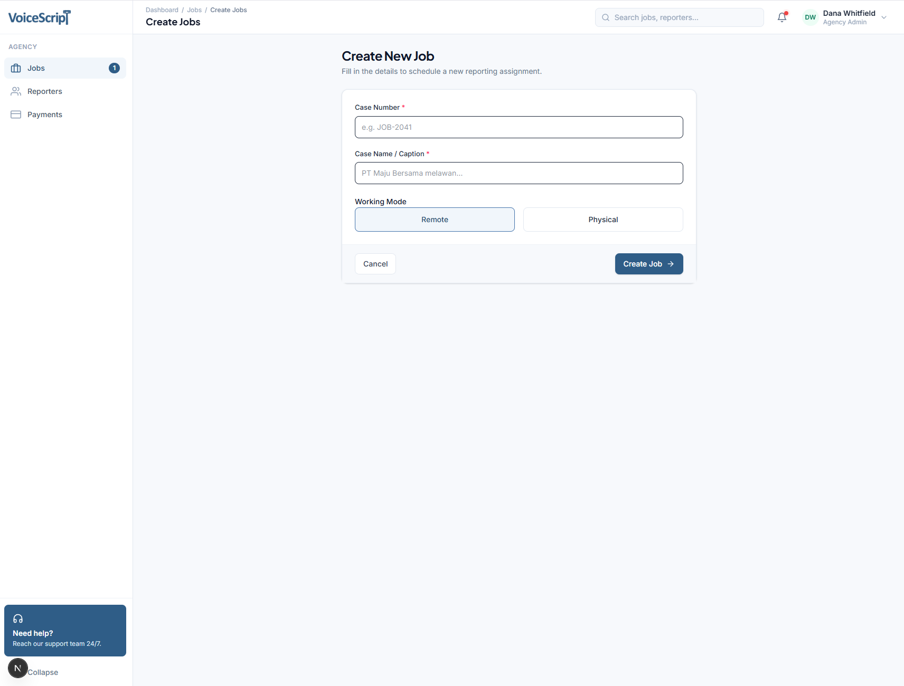
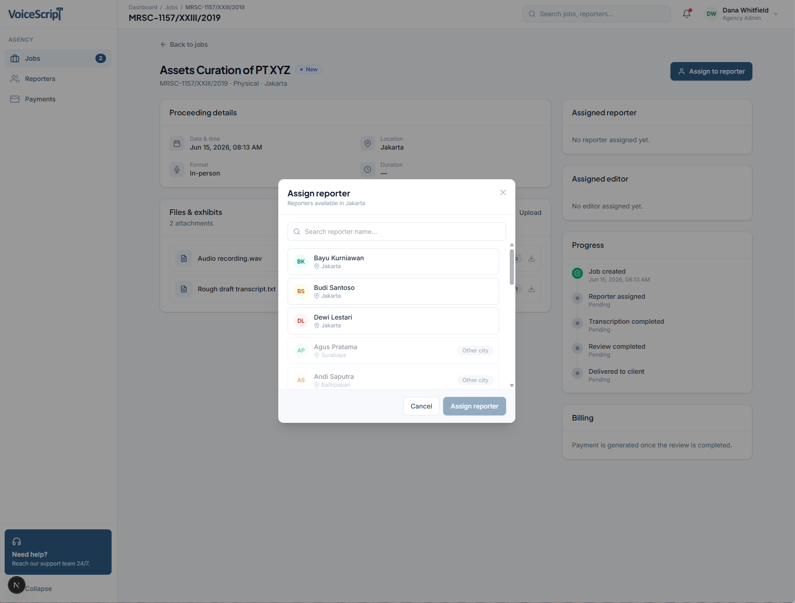
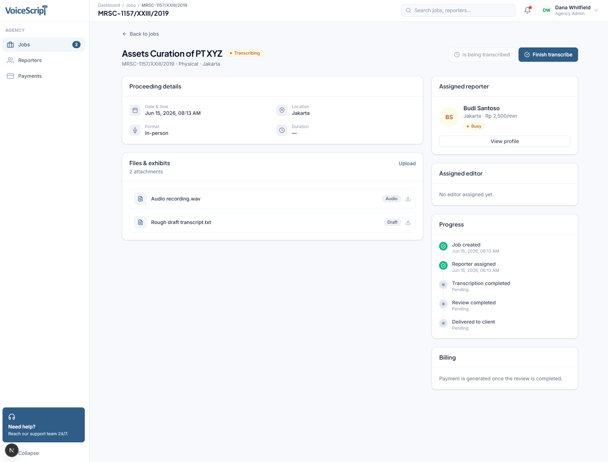
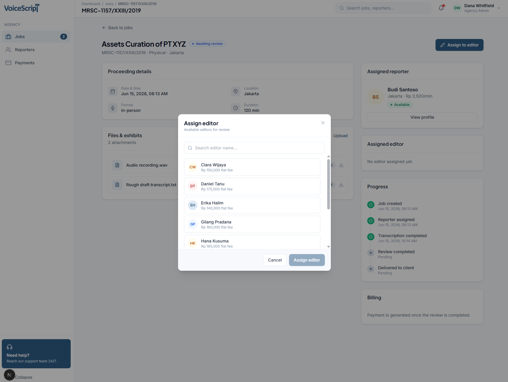
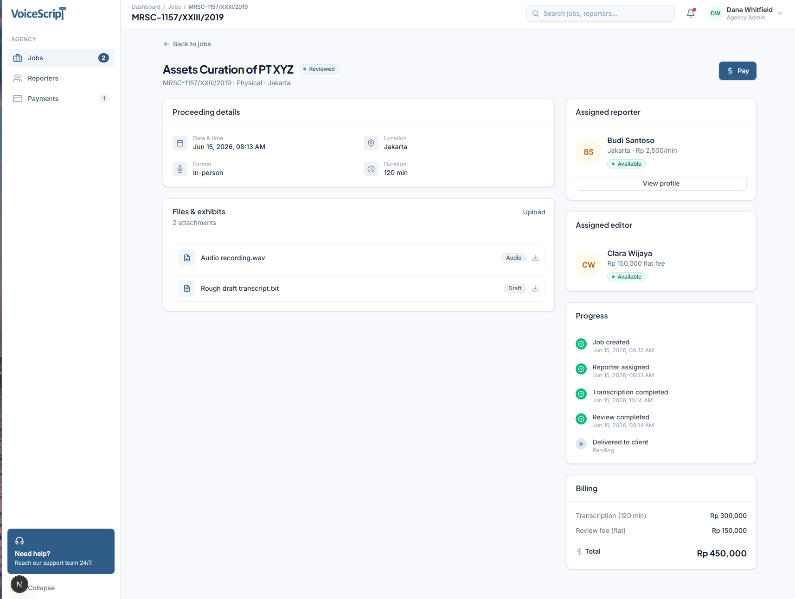
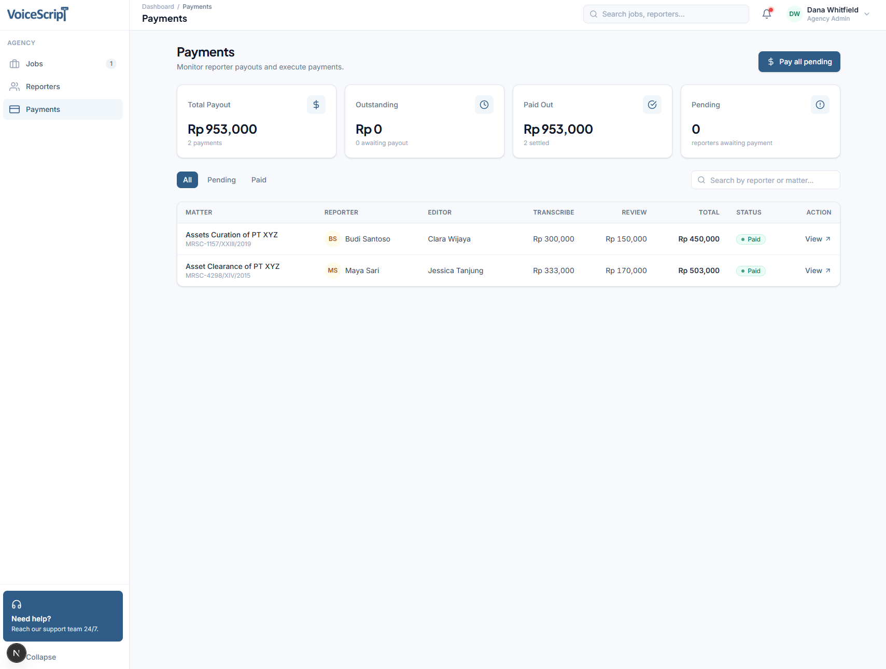

# VoiceScript — Court Reporting Workflow Manager

Manage transcription jobs end to end: assign reporters, assign editors, track
status, and calculate payouts.

**Stack:** Next.js (web) · NestJS (api) · PostgreSQL · Prisma · Turborepo

---

## Run it locally

Prerequisites: **Node 18+** and **Docker**.

```bash
# 1. Start PostgreSQL (creds are baked into docker-compose.yml + apps/api/.env)
docker compose up -d

# 2. Install all workspaces
npm install

# 3. Generate the Prisma client and apply migrations
cd apps/api
npx prisma generate
npx prisma migrate deploy

# 4. Seed reporters & editors
npm run db:seed

# 5. Start everything (from the repo root)
cd ../..
npm run dev    # turbo dev
```

| App | URL |
| --- | --- |
| Web | http://localhost:3001 |
| API | http://localhost:3000/api |

---

## Workflow: create → completed

A job moves through `NEW → ASSIGNED → TRANSCRIBED → REVIEWED → COMPLETED`. Each
step below is an action on the job detail page.

**1. Create a job** — case name, working mode (remote/physical), and city.
Status starts at `NEW`.



**2. Assign a reporter** — physical jobs match the reporter's city; remote jobs
are unrestricted. Status → `ASSIGNED`.



**3. Start & finish transcription** — start the billable window, then enter the
finish time. Duration (minutes) is computed from the window. Status →
`TRANSCRIBED`.



**4. Assign an editor & finish review** — an editor reviews the transcript. On
finish, the payment is calculated and snapshotted. Status → `REVIEWED`.



**5. Pay** — settle the payout. Status → `COMPLETED`.



**Payouts** — every settled and pending payment, with per-job earnings
(`reporter rate × minutes + editor flat fee`).


